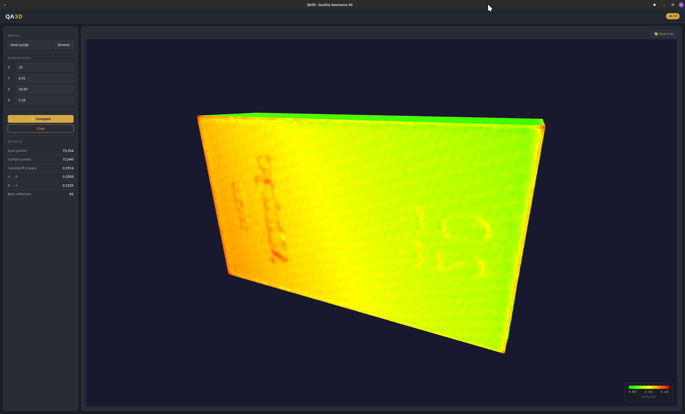

# QA3D 0.1.0


Quality Assurance 3D application for comparing scanned models against generated reference surfaces. QA3D reads `.xyzrgb` scan files, generates a rectangular prism surface from user-specified dimensions, and registers the scan to the surface using PCA alignment and ICP.



**Key Features:**
- **XYZRGB Model Loading** — reads 3D scan data from `.xyzrgb` files
- **Surface Generation** — creates rectangular prism point clouds from X, Y, Z dimensions
- **Auto-Density Calculation** — automatically matches surface point density to the scan
- **PCA + ICP Registration** — point-to-point ICP with 8-axis reflection search
- **3D Visualization** — interactive Three.js viewer with distance heatmap and dual-color modes

## Architecture

| Layer | Technology |
|-------|-----------|
| Backend | Julia + Genie |
| Frontend | HTML/CSS/JS |
| Visualization | Three.js + OrbitControls |
| Packaging | PackageCompiler `create_app` |

## Project Structure

```
QA3D/
├── src/
│   ├── QA3D.jl               # Module entry point
│   ├── routes.jl              # API routes
│   ├── xyzrgb_reader.jl       # .xyzrgb file parser
│   ├── surface_generator.jl   # Box surface point generator
│   └── registration.jl        # PCA + point-to-point ICP
├── views/index.html           # Single-page UI
├── public/
│   ├── css/styles.css         # Dark theme
│   ├── js/app.js              # Frontend logic
│   ├── js/viewer.js           # Three.js 3D viewer
│   └── favicon.svg            # App icon
├── build/                     # Packaging scripts
├── data/                      # Example scan data
│   └── block.xyzrgb           # Gauge block scan (73K points)
├── start.sh                   # Linux dev startup
└── start.bat                  # Windows dev startup
```

## Example Data

The `data/` directory contains an example gauge block scan (`block.xyzrgb`, 73,254 points). Use dimensions **20 × 8.91 × 34.90 mm** when comparing.

## Installation

### Prerequisites
- Julia 1.11+

### Development Setup

```bash
git clone https://github.com/dpaa-gov/QA3D
cd QA3D
julia --project=. -e "using Pkg; Pkg.instantiate()"
```

### Running

```bash
# Linux
chmod +x start.sh
./start.sh

# Windows
start.bat
```

The browser will open automatically when the server is ready at http://127.0.0.1:8001

## Usage

1. Click **Browse** to select a `.xyzrgb` scan file
2. Dimensions default to **X**: 20, **Y**: 8.91, **Z**: 34.90 — adjust to match your gauge block
3. **D** (density) auto-calculates when a file is selected, based on the scan's point count and box surface area:
   ```
   d = sqrt( 2(XY + XZ + YZ) / n_scan_points )
   ```
   This generates a reference surface with similar point density to the scan. You can override D manually.
4. Click **Compare** to run PCA + ICP registration
5. Results appear in the left panel and the **3D viewer** shows both clouds overlapping

### 3D Viewer

After a comparison completes, the viewer displays both point clouds registered together:

- **Heatmap mode** (default) — each point is colored green → yellow → red by its distance to the nearest point on the other cloud. The color legend shows the auto-scaled distance range.
- **Dual color mode** — scan points shown in gold, reference surface in blue, for visual separation. Toggle between modes with the 🎨 button above the viewer.

Use mouse to **orbit** (left-drag), **zoom** (scroll), and **pan** (right-drag).

### Registration Algorithm

1. **PCA alignment** — centers both point clouds and rotates the scan via principal component analysis
2. **8-reflection search** — PCA can flip axes, so all 8 sign permutations (±X, ±Y, ±Z) are tested
3. **Point-to-point ICP** — for each reflection, SVD-based rigid body alignment iteratively refines the fit
4. **Bidirectional Hausdorff** — `(mean_A→B + mean_B→A) / 2` measures the final fit quality
5. The reflection with the lowest Hausdorff distance is selected as the best result

### Interpreting Results

- **Hausdorff (mean)** — average surface deviation; lower = better scanner accuracy
- **A → B** — mean distance from scan to surface (scanner noise)
- **B → A** — mean distance from surface to scan (coverage gaps)
- **Best reflection** — which axis permutation produced the best alignment

## Building Distribution

Builds a standalone compiled executable using PackageCompiler `create_app`. No Julia installation required on the target machine.

### Build Prerequisites

- Julia 1.11+ (build machine only)
- All project dependencies installed (`julia --project=. -e "using Pkg; Pkg.instantiate()"`)

### Build Steps

**Linux:**
```bash
bash build/package.sh
```
Output: `dist/QA3D-v0.1.0-linux-x86_64.tar.gz`

**Windows:**
```cmd
build\package.bat
```
Output: `dist\QA3D-v0.1.0-windows-x86_64.zip`

**Windows Installer** (optional, requires [Inno Setup 6+](https://jrsoftware.org/isinfo.php)):
```cmd
iscc build\installer.iss
```
Output: `dist\QA3D-v0.1.0-windows-setup.exe` — standard setup wizard with Start Menu and desktop shortcuts.

Build time is approximately 5–15 minutes. The bundle includes a compiled `qa3d` executable, Julia runtime, all packages with artifacts, and web assets.

### Deploying

**Linux:**
```bash
tar xzf QA3D-v0.1.0-linux-x86_64.tar.gz
cd QA3D-v0.1.0-linux-x86_64
bin/qa3d
```


**Windows:**
```cmd
REM Extract the zip, then:
cd QA3D-v0.1.0-windows-x86_64
bin\qa3d.exe
```

The browser opens automatically at http://127.0.0.1:8001. The executable can be launched from the terminal or by double-clicking.

### Development (no build needed)

```bash
./start.sh    # Linux
start.bat     # Windows
```

Runs from source using JIT compilation. The browser opens automatically when the server is ready.

## Citation

Lynch, J.J. 2026 QA3D. Quality Assurance 3D. Version 0.1.0. Defense POW/MIA Accounting Agency, Offutt AFB, NE.

## Known Issues

| Issue | Status | Details |
|-------|--------|---------|
| Compiled app crashes on Julia 1.12 | **Open — upstream bug** | PackageCompiler `create_app` bundles built with Julia 1.12 crash on startup. Genie's `Assets.__init__()` calls `Pkg.dependencies()`, which fails because the stdlib metadata directory (`share/julia/stdlib/`) is missing from the bundle. **Workaround**: build with Julia 1.11.x. Linux builds with 1.11.4 work on machines without Julia installed. See [PackageCompiler.jl #989](https://github.com/JuliaLang/PackageCompiler.jl/issues/989) and [#1076](https://github.com/JuliaLang/PackageCompiler.jl/issues/1076). |

## TODO

- [ ] Thread the 8-reflection ICP loop for ~8x speedup (~60s → ~10s)

## License

GNU General Public License v2.0 — see [LICENSE](LICENSE) for details.
